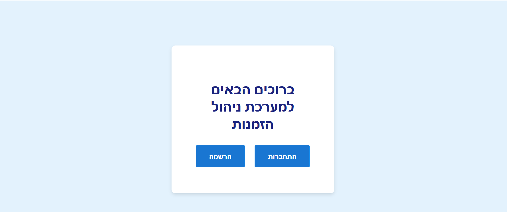
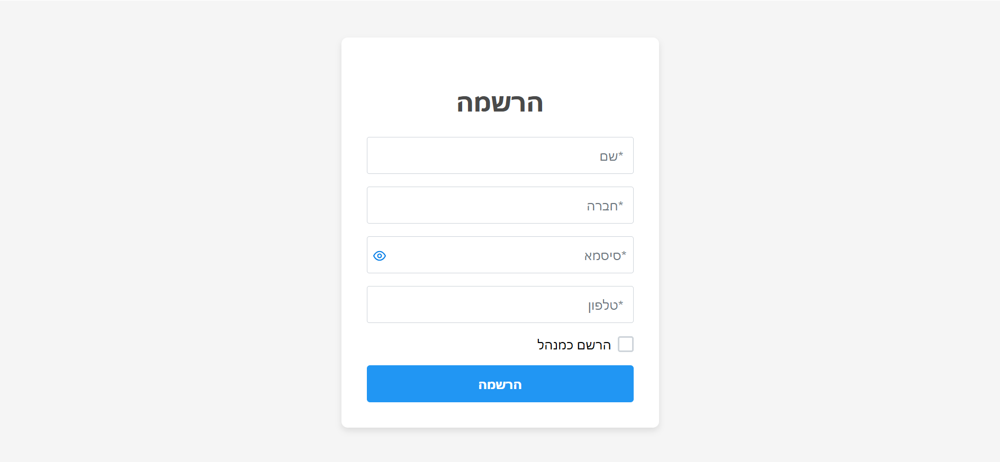
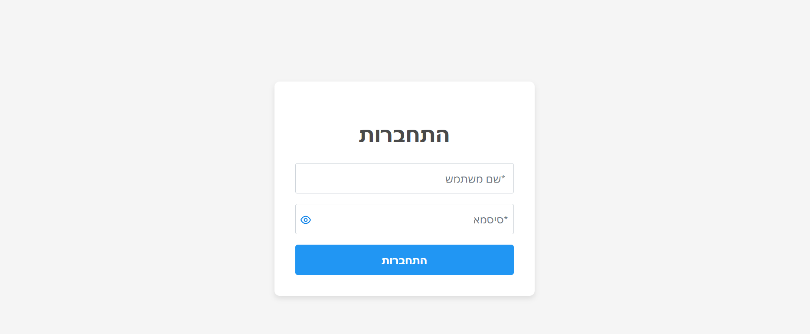
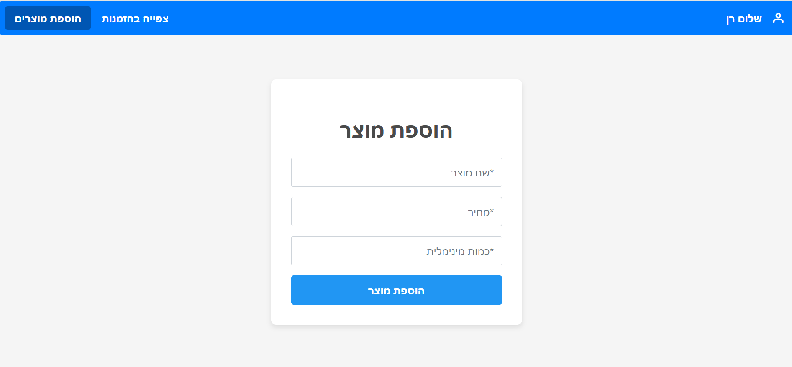
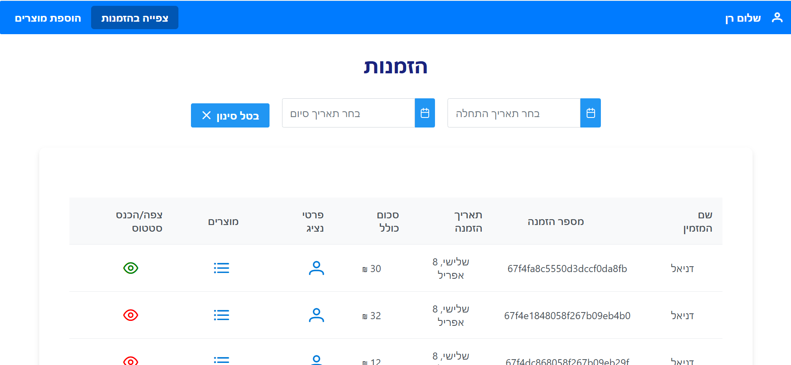
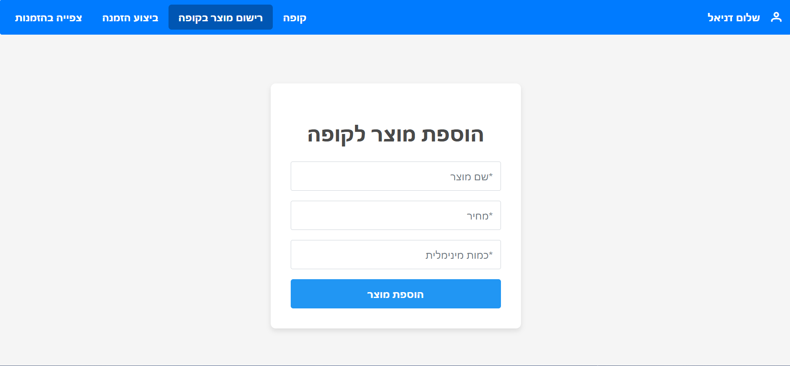
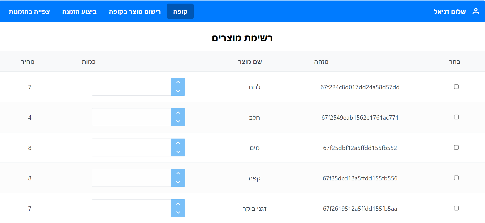
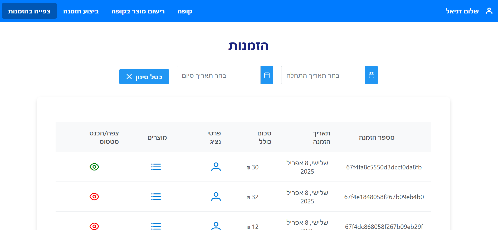
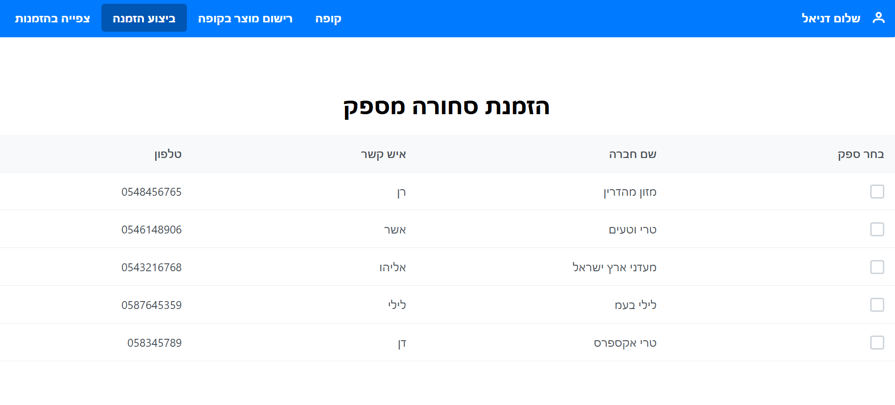
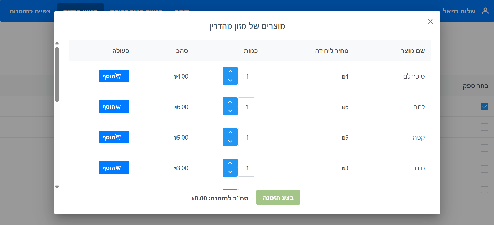

# Grocery Store Management System

## Description

This project is a **management system** for a local grocery store, designed to assist the store owner in managing inventory and supplier orders.
Built with **Node.js**, **React**, and **MongoDB** , this system allows the store owner to easily manage orders, track inventory, and communicate with suppliers.

## Features
- **Sign Up / Login**: Suppliers can register and log in to the system secured by token.
  **real time updates between manger/supplier using socket**
### Supplier
- **View Orders**: Suppliers can view the orders placed by the store owner.
- **Order Confirmation**: Once an order is confirmed, it will be marked as "In Progress."

### Store Owner (built for multiple owners in case of future demand)
- **Place Order**: Store owners can place orders with suppliers.
- **Automatic order**: once the store is out of stock, an order will be placed automaticly to the cheapest supplier (amount should be pre set, currently the highest between alowed min in store, alowed min by supplier and amount of purchase), orders can be made through "kupa", 
- **View Order Status**: Track the status of existing orders.
- **Confirm Order Reception**: Once an order is received, it will be marked as "Completed" and the supplier will be notified.

## Screens

## Prerequisites

Before setting up the project, ensure you have the following installed:
- **Node.js**: Follow the installation guide at [nodejs.org](https://nodejs.org/en/).
- **create-react-app**: Install this globally to easily run the project and build source files. Use `npm install -g create-react-app` in your terminal.

## Cloning and Running the Application Locally

1. **Clone the Project**: Clone the repository to your local machine using `git clone https://github.com/ElishevaKlor/HomeTest.git`.
2. **Install NPM Packages**: Navigate to the project directory and execute `npm install` to install all required npm packages.
3. **Run the Application**: Start the application by running `npm start`. This will launch the app in your default web browser.

The application will run on [localhost:5000](http://localhost:3000).
